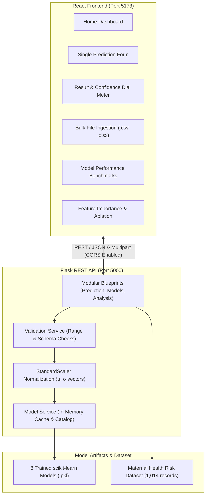

# A Comparative Analysis of Machine Learning Algorithms for Maternal Risk Prediction Using Healthcare Data

[](frontend/)
[](frontend/)
[](backend/)
[](backend/)
[](frontend/)

A full-stack, data-driven clinical decision-support system designed to assess and classify maternal health risk levels into **Low Risk**, **Mid Risk**, or **High Risk**. 

The system analyzes six physiological parameters captured during routine prenatal care, standardizes them, and runs inference through eight evaluated machine learning models, with **Random Forest** achieving the highest predictive accuracy (**85.25%**).

---

## 1. System Architecture



---

## 2. Clinical Dataset & Physiological Features

The project is built on the **Maternal Health Risk Dataset** ([`backend/dataset/Maternal Health Risk Data Set.csv`](file:///c:/Users/omkar/OneDrive/Desktop/MaternalRisk_Prediction/backend/dataset/Maternal%20Health%20Risk%20Data%20Set.csv)), containing **1,014 clinical records** across three target risk levels:
- **Low Risk**: 406 records (40.04%)
- **Mid Risk**: 336 records (33.14%)
- **High Risk**: 272 records (26.82%)

### Evaluated Clinical Features

| Feature Name | Clinical Parameter | Valid Range | Standard Unit | Default Value | Importance Rank |
| :--- | :--- | :--- | :--- | :--- | :--- |
| **`BS`** | Blood Glucose / Sugar | 1.0 – 30.0 | mmol/L | 6.5 | **#1 (35.28%)** |
| **`SystolicBP`** | Systolic Blood Pressure | 50 – 250 | mmHg | 120 | **#2 (18.45%)** |
| **`Age`** | Maternal Age | 10 – 100 | years | 25 | **#3 (16.77%)** |
| **`DiastolicBP`** | Diastolic Blood Pressure | 30 – 150 | mmHg | 80 | **#4 (12.06%)** |
| **`HeartRate`** | Resting Heart Rate | 30 – 220 | bpm | 75 | **#5 (10.30%)** |
| **`BodyTemp`** | Body Temperature | 90.0 – 110.0 | °F | 98.6 | **#6 (7.14%)** |

---

## 3. Machine Learning Evaluation & Results

Eight algorithms were evaluated using stratified train/test splits and 5-fold cross-validation:

| Model | Artifact File | Type | Probability Support | Test Accuracy | Status |
| :--- | :--- | :--- | :--- | :--- | :--- |
| **Random Forest** | `Random_Forest.pkl` | Bagging Ensemble | Yes (`predict_proba`) | **85.25%** | **Best Model** |
| **Decision Tree** | `Decision_Tree.pkl` | Rule-based Tree | Yes (`predict_proba`) | **82.62%** | Verified |
| **Tuned Random Forest** | `Tuned_Random_Forest.pkl` | Optimized Ensemble | Yes (`predict_proba`) | **80.98%** | Verified |
| **Support Vector Machine (SVM)** | `SVM.pkl` | Kernel Classifier | No (Margin-based) | **69.51%** | Verified |
| **Tuned SVM** | `Tuned_SVM.pkl` | Optimized C/Gamma | No (Margin-based) | **69.18%** | Verified |
| **Tuned KNN** | `Tuned_KNN.pkl` | Optimized k-Neighbors | Yes (`predict_proba`) | **67.87%** | Verified |
| **K-Nearest Neighbors (KNN)** | `KNN.pkl` | Instance-based | Yes (`predict_proba`) | **67.21%** | Verified |
| **Logistic Regression** | `Logistic_Regression.pkl` | Linear Baseline | Yes (`predict_proba`) | **64.26%** | Verified |

### Preprocessing & Standardization
Every estimator expects standardized inputs computed using the recovered training distribution parameters:
$$\text{Scaled Value} = \frac{x - \mu}{\sigma}$$
- $\mu = [29.87179487, 113.19822485, 76.46055227, 8.72598619, 98.66508876, 74.30177515]$
- $\sigma = [13.46773972, 18.39483561, 13.87894700, 3.29190729, 1.37070798, 8.08471278]$

### Target Class Mapping
Numeric classes returned by the models map directly to:
$$\{0: \text{"high risk"},\ 1: \text{"low risk"},\ 2: \text{"mid risk"}\}$$

---

## 4. Repository Structure

```
MaternalRisk_Prediction/
│
├── backend/
│   ├── dataset/
│   │   └── Maternal Health Risk Data Set.csv    # Benchmark dataset (1,014 rows)
│   │
│   ├── models/
│   │   ├── Decision_Tree.pkl                   # Decision Tree
│   │   ├── KNN.pkl                             # K-Nearest Neighbors
│   │   ├── Logistic_Regression.pkl             # Logistic Regression
│   │   ├── Random_Forest.pkl                   # Random Forest (Best Model)
│   │   ├── SVM.pkl                             # Support Vector Machine
│   │   ├── Tuned_KNN.pkl                       # Tuned KNN
│   │   ├── Tuned_Random_Forest.pkl             # Tuned Random Forest
│   │   └── Tuned_SVM.pkl                       # Tuned SVM
│   │
│   ├── routes/
│   │   ├── analysis_routes.py                  # /feature-importance, /ablation-study
│   │   ├── model_routes.py                     # /, /models, /model-performance
│   │   └── prediction_routes.py                # /predict, /bulk-predict, /predict-bulk
│   │
│   ├── services/
│   │   ├── dataset_service.py                  # Benchmark metrics & dataset analysis
│   │   ├── model_service.py                    # Model caching, catalog & introspection
│   │   ├── prediction_service.py               # Feature standardization & inference
│   │   └── validation_service.py               # Boundary validation & spreadsheet parsing
│   │
│   ├── tests/
│   │   └── test_app.py                         # 14 unit & integration tests
│   │
│   ├── .env                                    # Active environment configuration
│   ├── .env.example                            # Configuration template
│   ├── app.py                                  # Application factory (create_app)
│   ├── config.py                               # Physiological bounds, scaler arrays & specs
│   ├── requirements.txt                        # Pinned dependencies
│   ├── utils.py                                # Standardized JSON error response helper
│   └── README.md                               # Backend documentation
│
├── frontend/
│   ├── src/
│   │   ├── components/                         # UI components (RiskGauge, ResultCard, etc.)
│   │   ├── data/                               # Clinical metadata & benchmark baselines
│   │   ├── pages/                              # Home, Prediction, Bulk, Performance, etc.
│   │   ├── services/                           # Typed API client connecting to backend
│   │   ├── types/                              # TypeScript interfaces
│   │   ├── App.tsx                             # Router configuration
│   │   └── main.tsx
│   │
│   ├── package.json                            # React 18, Vite 5, Tailwind 3, Recharts 3
│   ├── tailwind.config.js                      # Custom medical styling configuration
│   ├── tsconfig.app.json                       # TypeScript compiler settings
│   └── README.md                               # Frontend documentation
│
└── README.md                                   # Root project documentation
```

---

## 5. Quickstart Guide

### Prerequisites
- **Python**: 3.10 or 3.11
- **Node.js**: 18.0 or higher
- **npm**: 9.0 or higher

---

### Step 1: Start the Python Flask Backend

Open **Terminal 1**:

**Windows PowerShell:**
```powershell
cd backend
python -m venv .venv
.\.venv\Scripts\Activate.ps1
pip install -r requirements.txt
python app.py
```

**Linux / macOS:**
```bash
cd backend
python3 -m venv .venv
source .venv/bin/activate
pip install -r requirements.txt
python app.py
```

The Flask API will initialize all 8 models and start listening on:
`http://127.0.0.1:5000`

---

### Step 2: Start the React Frontend

Open **Terminal 2**:

```powershell
cd frontend
npm install
npm run dev
```

The React web application will start on:
`http://localhost:5173`

Open your browser and navigate to `http://localhost:5173`. The system health status indicator in the header will display **System Ready**.

---

## 6. REST API Reference

| Endpoint | Method | Description | Sample Request / Format |
| :--- | :--- | :--- | :--- |
| `GET /` | `GET` | Health check & feature schema | None |
| `GET /models` | `GET` | Catalog of 8 pre-trained models | None |
| `POST /predict` | `POST` | Single patient risk evaluation | `{ "Age": 25, "SystolicBP": 120, "DiastolicBP": 80, "BS": 6.5, "BodyTemp": 98.6, "HeartRate": 75, "model": "random_forest" }` |
| `POST /bulk-predict` | `POST` | Batch prediction via JSON array | `{ "records": [ ... ], "model": "random_forest" }` |
| `POST /predict-bulk` | `POST` | Batch prediction via file upload | `multipart/form-data` with `file` (`.csv`, `.xls`, `.xlsx`) |
| `GET /model-performance` | `GET` | Comparative accuracy benchmarks | Optional query `?live=true` for dataset re-evaluation |
| `GET /feature-importance` | `GET` | Random Forest MDI feature weights | None |
| `GET /ablation-study` | `GET` | Pipeline ablation experiments | Optional query `?live=true` for 80/20 live split |

---

## 7. Testing & Quality Assurance

### Backend Unit & Integration Tests
Run all 14 backend test cases covering health checks, single prediction across all models, validation errors, bulk predictions, file uploads, and analytics:

```powershell
cd backend
.\.venv\Scripts\python.exe -m unittest backend.tests.test_app -v
```

### Frontend Typecheck & Build
Verify TypeScript contracts and compile the production client bundle:

```powershell
cd frontend
npm run typecheck
npm run build
```

---

## 8. Ethical & Clinical Disclaimer

> **IMPORTANT**: This software is developed strictly for **educational and research purposes**. It is intended as an exploratory clinical decision-support tool and **must not be used as an autonomous diagnostic system or as a substitute for professional medical advice, clinical judgment, or patient evaluation by licensed healthcare providers**.
